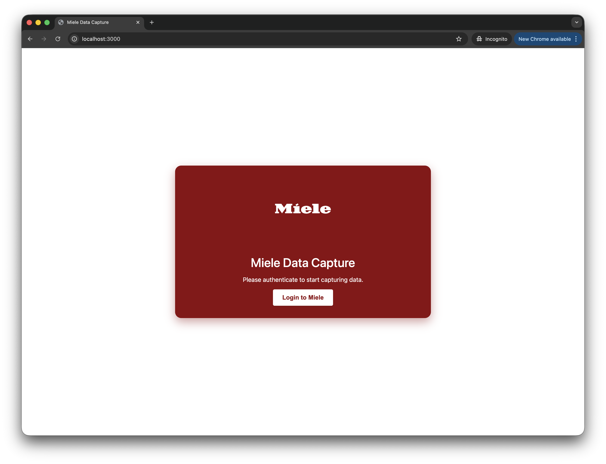
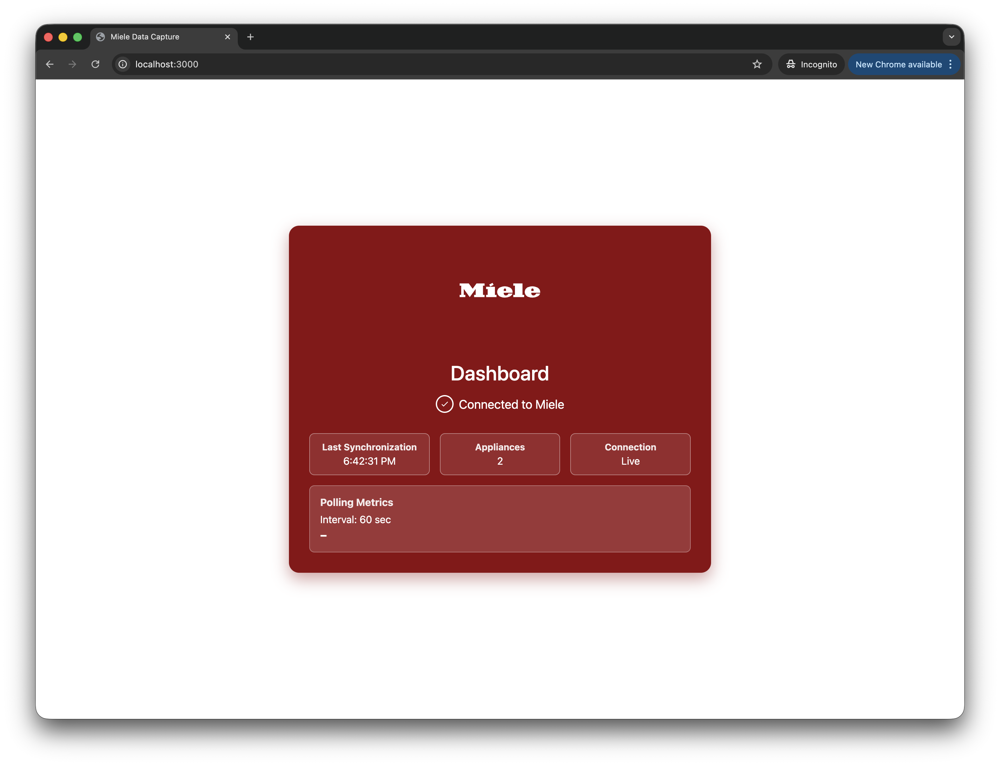

# Miele Data Capture

Application to track state changes and statuses of Miele appliances by polling the Miele 3rd Party API and pushing the data directly into InfluxDB v2.

## Supported Metrics

The application collects rich device telemetry and pushes the following data to InfluxDB:
- **Device Identifiers**: `deviceType`, `model_name` (augmented with `techType`), and `appliance_id`.
- **States & Programs**: Raw numeric IDs and localized string labels for Status, Program Type, and Program Phase.
- **Timers**: `remainingTime` and `elapsedTime` are automatically aggregated into total seconds.
- **EcoFeedback**: Full capture of energy/water consumption feedback data.
- **Filling Levels**: Device ingredient levels (e.g., TwinDos, Rinse Aid, salt). Empty or null values are automatically filtered.

## Prerequisites

- Node.js > 20
- Docker (optional)
- InfluxDB v2 instance
- Registered Application at [Miele Developer Portal](https://developer.miele.com)

## Screenshots

| Login View | Dashboard View |
|:---:|:---:|
|  |  |

## Setup

1. Register an OAuth application on the Miele Developer Portal. 
2. Set the redirect URI to `<your_host>:<port>/callback` (e.g., `http://localhost:3000/callback`).
3. Clone this repository.
4. Run `npm install`.
5. Copy `.env.example` to `.env` and fill in the values:
   - `MIELE_CLIENT_ID` and `MIELE_CLIENT_SECRET`: Your Miele App credentials.
   - `MIELE_PORT`: Local port for the auth server (default: `3000`).
   - `MIELE_POLL_INTERVAL`: How often to poll in seconds (default: `60`).
   - `MIELE_DRYRUN`: If `true`, data won't be pushed to InfluxDB.
   - `MIELE_INFLUX_*`: Your InfluxDB configuration. 

## Running Locally

```bash
npm install
npm start
```

Then navigate to `http://localhost:3000` to authorize the application. Once authorized, it will start polling the Miele API and saving the data.

The tokens are saved securely to `token.json` in the root directory.


This ensures that the server runs strictly attached to your active terminal on `http://localhost:<MIELE_PORT>` for immediate log inspection.

## Testing

Run tests via Jest:
```bash
npm test
```

## Docker Deployment

Build the container:
```bash
docker build -t miele-data-capture .
```

Run the container (make sure you persist `token.json`!):
```bash
docker run -d \
  -p 3000:3000 \
  --env-file .env \
  --name miele-data-capture \
  miele-data-capture
```
If you start the container and `token.json` is missing/empty, just go to `http://<your_server_ip>:3000/` and click the authorization link to authenticate.
